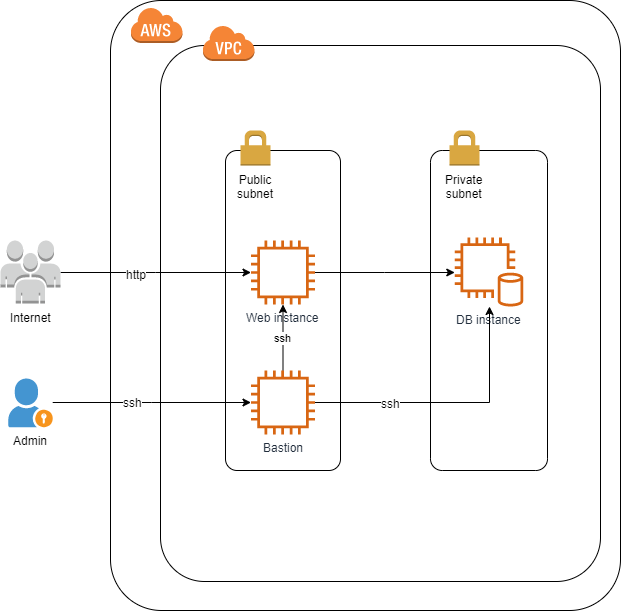

# About
This project is an implementation of a solution to setup Wordpress on two EC2 instances in AWS cloud.

## Tools

This implementation uses the following tech:

- Terraform for infrastructure setup.
- Ansible for application setup and configuration management. 

## Pre-requisites

The implementation is built and tested on CentOS 7 Linux, using Terraform 0.12 and Ansible 2.8.

The following need to be installed locally and present on PATH:

- [Terraform](https://www.terraform.io/downloads.html)
- [Ansible](https://docs.ansible.com/ansible/latest/installation_guide/intro_installation.html)
- [AWS CLI](https://docs.aws.amazon.com/cli/latest/userguide/cli-chap-install.html)

### AWS authentication

IAM credentials can be provided via the envrionment variables AWS_ACCESS_KEY_ID and AWS_SECRET_ACCESS_KEY, representing AWS Access Key and AWS Secret Key, respectively.

```
$ export AWS_ACCESS_KEY_ID="Your Access Key"
$ export AWS_SECRET_ACCESS_KEY="Your Secret Key"
```

### AWS IAM policy

At least the following should be allowed in IAM policy of the IAM user who will be running the installation:

```
{
   "Version": "2012-10-17",
   "Statement": [{    
            "Effect": "Allow",
            "Action": "ec2:*",
            "Resource": "*"
        },
        {
            "Sid": "AllowManageOwnAccessKeys",
            "Effect": "Allow",
            "Action": [
                "iam:CreateAccessKey",
                "iam:DeleteAccessKey",
                "iam:ListAccessKeys",
                "iam:UpdateAccessKey"
            ],
            "Resource": "arn:aws:iam::*:user/${aws:username}"
        },
        {
            "Sid": "AllowManageOwnSSHPublicKeys",
            "Effect": "Allow",
            "Action": [
                "iam:DeleteSSHPublicKey",
                "iam:GetSSHPublicKey",
                "iam:ListSSHPublicKeys",
                "iam:UpdateSSHPublicKey",
                "iam:UploadSSHPublicKey"
            ],
            "Resource": "arn:aws:iam::*:user/${aws:username}"
        },
        {
            "Effect": "Allow",
            "Action": [
                "secretsmanager:CreateSecret",
                "secretsmanager:DeleteSecret",
                "secretsmanager:Get*",
                "secretsmanager:Describe*" 
            ],
            "Resource": "arn:aws:secretsmanager::*:user/${aws:username}"
        },
        {
            "Effect": "Allow",
            "Action": [
                "ssm:*"
            ],
            "Resource": "*"
        },
        {
            "Effect": "Allow",
            "Action": [
                "kms:Describe*" 
            ],
            "Resource": "*"
        },
        {
            "Sid": "AllowClusterPermissions",
            "Effect": "Allow",
            "Action": [
                "elasticache:Describe*",
                "elasticache:List*"
                ],
            "Resource": "*"
       }
   ]
}
```

### Terraform

This implementation supports Terraform version 0.12. It utilizes modules to manage complex resources like VPC. This implementation does not use a remote backend for Terraform state and stores the state locally.

### Terraform variables

This implementation parameterizes required configurable settings through variables. Custom variables are defined in `variables.tf` and their values are controlled through `terraform.tfvars`.

## Architecture



### Bastion

Bastion host allows SSH connectivity to Web instance and Database instance from outside of VPC. Bastion is created in a public subnet with Elastic IP attached. Access to bastion is restricted to a number of IP addresses using security group. SSH key pair for bastion host is created with Terraform and written to SSM Parameter Store.

# Installation instructions

Make sure you have pre-requisites and AWS authentication setup as mentioned above. 

### Clone repository

Clone the solution repository and go into its directory:

```
git clone git@github.com:0leksei/wordpress-aws.git
cd wordpress-aws
```

### Run installation

Prepare sensitive values, e.g passwords. You can set and export environment variables like this, replacing with correct values:

```
$ export AWS_ACCESS_KEY_ID="Your Access Key"
$ export AWS_SECRET_ACCESS_KEY="Your Secret Key"
$ export wp_mysql_password="Wordpress MySQL user password"
$ export mysql_root_password="MySQL root password"
```

Tune variables values in `terraform.tfvars` as needed, and make sure to specify your IP address and whitelist it for HTTP and SSH connectivity.

Execute `install.sh` to launch resources:

```
. install.sh
```

### Next steps

When `install.sh` has finished, it will echo a message with the URL of the created Wordpress site. Open this URL in a browser and proceed with Wordpress setup.

# Cleanup

To destroy all created resources, run `uninstall.sh`:

```
. uninstall.sh
```

